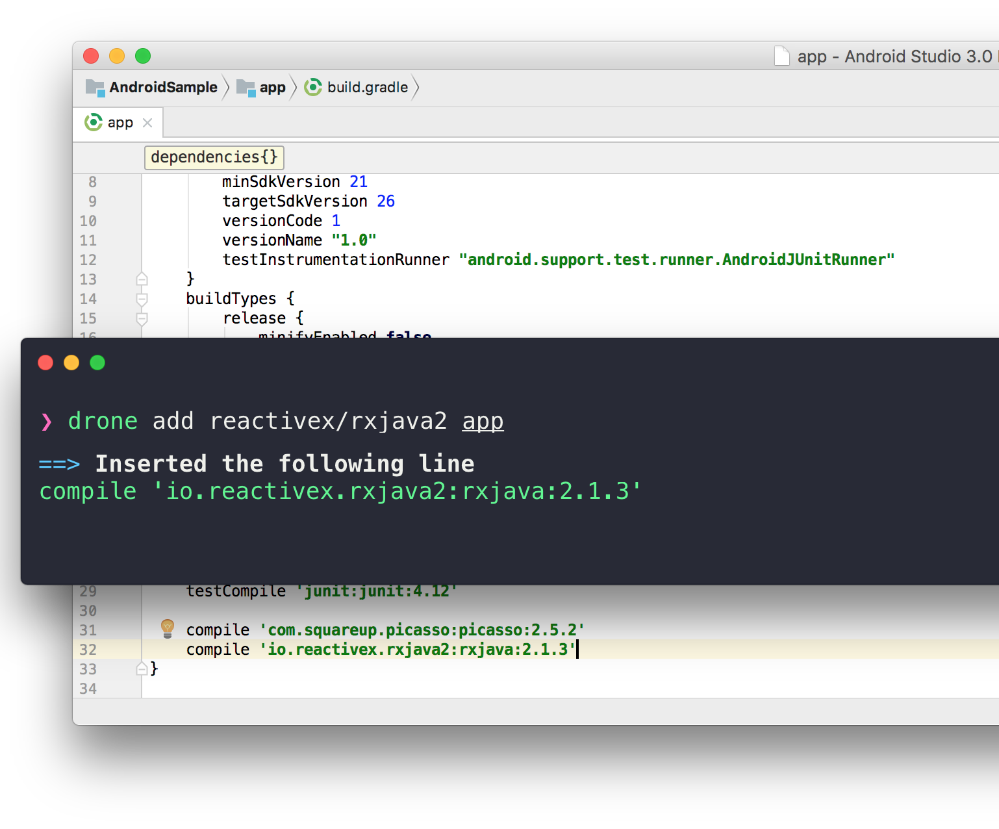

# drone
> The missing package manager for Android

<p align="center">

</p>

[](https://travis-ci.org/cesarferreira/drone)
[](https://www.npmjs.com/package/drone)
[](https://www.npmjs.com/package/drone) 


## Why I made this?
Me, as an android developer was jealous of the nodejs community for their fast and reliable dependency managers, it's so easy to write `yarn add <library>` and the library is imported into the project... So I made `drone` for android!

## Install

```sh
npm install -g drone
```

## Usage
Simple usage:
> `drone` add `creator/library` `module`

```
Usage

   $ drone <command> <params>

   $ drone install                            # Downloads the packages
   $ drone test <creator/library>             # Tests the library by fetching its version
   $ drone add <creator/library> <module>     # Adds a dependency to a module
   $ drone info <creator/library>             # Retrieves the info for this package
   $ drone update                             # Get the latest packages
   $ drone stats                              # Get some stats regarding the hive
   $ drone hive                               # Opens the hive url
   $ drone open <creator/library>             # Opens the library's homepage
   $ drone create                             # Creates a new one if it's not in the server yet
   $ drone search <library>                   # Searches for the 'library' in the hive

 Examples

   $ drone install                            # Downnloads the packages
   $ drone info square/picasso                # Shows the info for square/picasso
   $ drone add square/retrofit app            # Adds retrofit to the 'app' module 
   $ drone open google/gson                   # Opens GSONs homepage
   $ drone create                             # takes you throught the creation wizard
   $ drone search rxjava                      # Searches the hive for 'rxjava'
   $ drone test square/picasso                # Tests the library by fetching its version
```

# Where are the libraries?

Instead of maintaining a server with all the possible libraries I'm going with a [brew](https://brew.sh/) approach, the community will `create` a library `once` and it will be available to everyone else forever in the [hive](https://github.com/cesarferreira/drone-hive)!

> $ drone create

follow the wizard to generate the `<library≥.json` file then open the pull request in the [hive](https://github.com/cesarferreira/drone-hive) with this format: 
> **hive/`<creator/library>`.json**


<p align="center">

</p>

## Created by
[Cesar Ferreira](https://cesarferreira.com)

## License
MIT © [Cesar Ferreira](http://cesarferreira.com)
